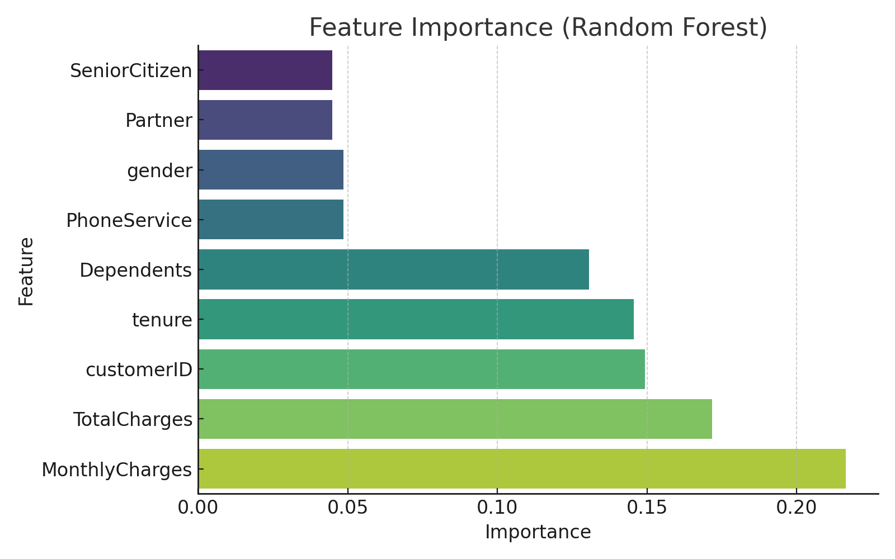

# Customer Churn Prediction (Demo)

This is a small project that builds a basic churn prediction model using Pandas and scikit-learn.

## Dataset

Custom CSV file with 10 features:
- gender, SeniorCitizen, Partner, Dependents, tenure, PhoneService, etc.
- Target: `Churn` (0 = stay, 1 = churn)

## Pipeline

- Data loading and exploration
- Null checks
- Label encoding
- Train/test split
- RandomForestClassifier
- Prediction, confusion matrix, classification report

## Result

Perfect prediction on test data (due to tiny dataset).

## 📊 Visualizations

### Feature Importance

### Churn Rate by Tenure

